# Guideline gán nhãn — GreenSM (taxi điện Xanh SM) · v1.0

| | |
|---|---|
| **Mục tiêu** | Mọi xe GreenSM trong ảnh đều có **một hộp ôm sát phần nhìn thấy**; không có hộp nào trên xe khác. Ba người gán ra cùng một kết quả. |
| **Dữ liệu** | Khung hình cắt từ video nhóm tự quay (rộng 1280 px), ngang tầm mắt, đường phố đô thị Việt Nam |
| **Công cụ** | CVAT · một label duy nhất `GreenSM` · shape **Rectangle** · export **YOLO 1.1** |
| **Lớp** | Chỉ 1 lớp: `0 = GreenSM`. Không tạo lớp khác. |
| **Nguyên tắc vàng** | ① Không sót xe GreenSM nào ② Hộp sát từng pixel ③ Không chắc thì **loại cả ảnh**, không đoán |
| **Phiên bản** | v1.0 · 04/10/2026 · người giữ guideline: Trịnh Nam Trung · trạng thái: **chờ nhóm duyệt** |

> Mọi nhãn do máy gán nháp **bắt buộc** phải có người mở ra xem và sửa (luật cuộc thi, slide 7). Không có ngoại lệ "máy tự tin thì bỏ qua".

---

## 1. Bốn điều cần biết trước khi gán

1. **Điểm chấm thưởng hộp ôm sát.** Điểm là mAP@[.5:.95], tức mỗi hộp bị chấm ở 10 mức độ trùng khớp (IoU) từ 0,50 đến 0,95. Hộp lỏng 10% chỉ đúng ở 4/10 mức (xem [mục 4](#4-vẽ-hộp-thế-nào-cho-đúng)).
2. **Xe GreenSM bị sót nhãn còn tệ hơn không có ảnh đó.** Model sẽ học rằng "chiếc xe này là nền". Luôn **quét toàn ảnh** trước khi bấm sang ảnh tiếp theo.
3. **Không chắc thì loại cả ảnh.** Gặp xe không chắc có phải GreenSM không, đừng đoán. Đánh dấu loại ảnh và ghi lý do vào log. Mất một ảnh rẻ hơn nhiều so với dạy model sai.
4. **Nhãn nháp của máy thường sai** theo vài kiểu quen thuộc ([mục 7](#7-nhãn-nháp-của-máy-hay-sai-kiểu-nào)). Nhiệm vụ của bạn là **sửa**, không phải bấm chấp nhận.

---

## 2. GreenSM là gì

**GreenSM = ô tô taxi Xanh SM sơn màu XANH NGỌC đặc trưng** (thường phối thêm bạc hoặc xám ở nóc và thân dưới, có logo "V Xanh SM").

Dấu hiệu nhận biết, xếp theo độ tin cậy:

| Dấu hiệu | Độ tin | Ghi chú |
|---|---|---|
| Thân **xanh ngọc** sáng (giữa xanh lá và xanh dương) | ★★★ | Dấu hiệu chính. Nhìn được cả ở xe rất xa |
| Logo **"V Xanh SM"** trên cửa hoặc đầu xe | ★★★ | Chỉ thấy khi xe gần |
| Phối **bạc/xám** ở nóc hoặc dải thân dưới | ★★ | Có ở hầu hết xe |
| Dáng VinFast (VF e34, VF 5, VF 8, Limo Green…) | ★ | Xe cá nhân VinFast cùng dáng nhưng khác màu thì **không** gán |
| Biển số vàng | ✗ | **Không dùng.** Xe kinh doanh vận tải nào cũng biển vàng |

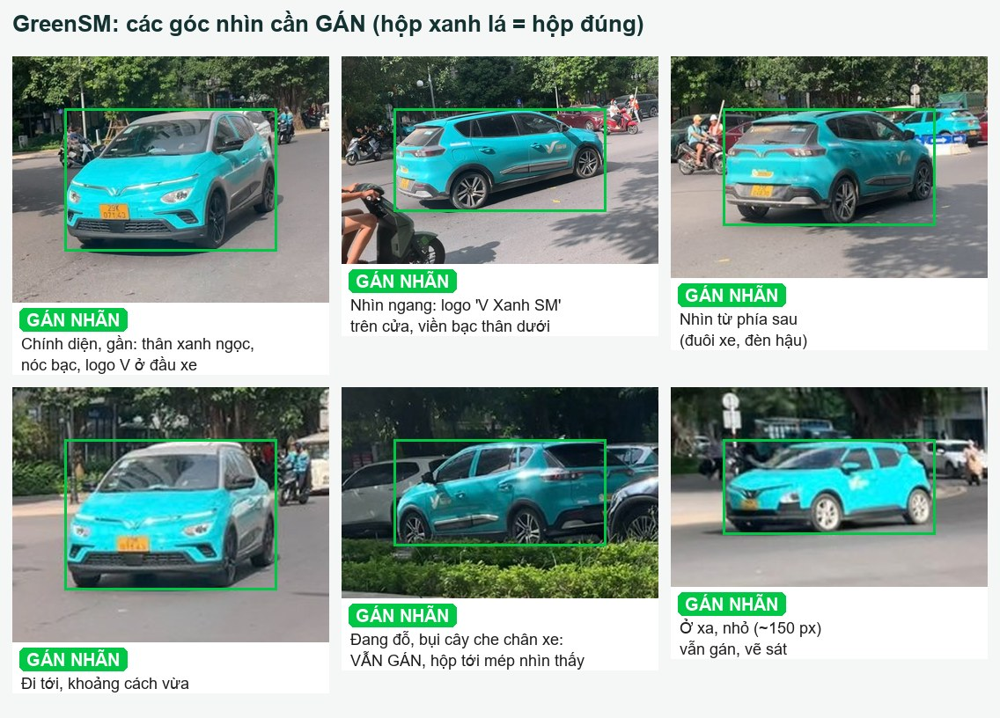

### 2.1. Dễ nhầm nhưng KHÔNG phải GreenSM

Không vẽ gì lên những xe này. Ảnh chỉ có những xe này thì vẫn giữ lại làm **ảnh nền** (file nhãn rỗng). Ảnh nền rất có ích: nó dạy model "đừng báo nhầm".

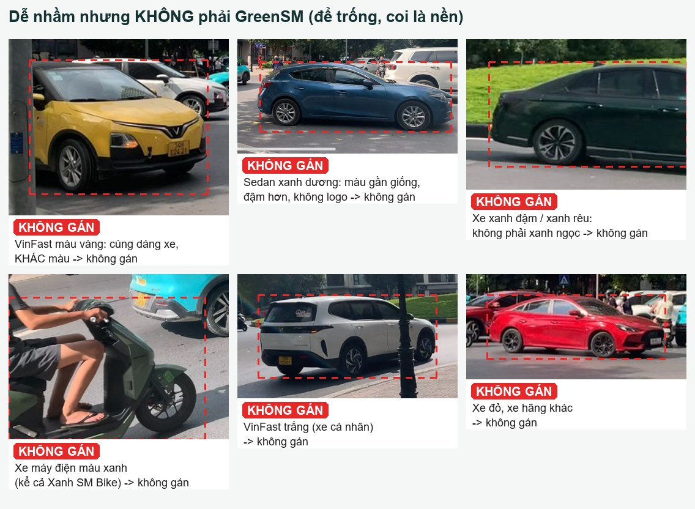

Ngoài ra cũng **không gán**:
- xe buýt (kể cả VinBus màu xanh);
- xe tải, xe máy, xe đạp, người mặc áo xanh Xanh SM;
- xe in trên poster, biển quảng cáo, màn hình;
- hình phản chiếu trên kính hoặc vũng nước.

### 2.2. Vùng xám: xe Xanh SM màu bạc

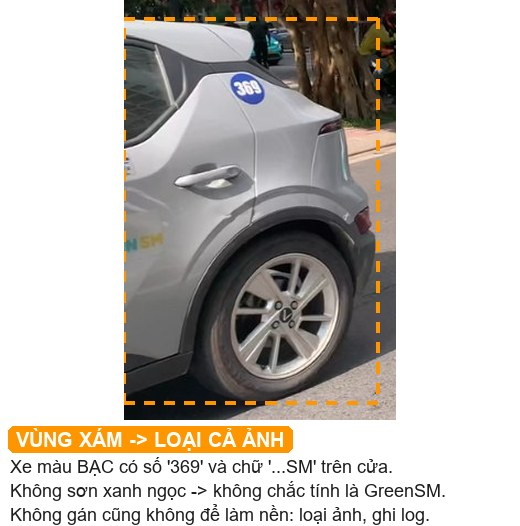

Xe **màu bạc/trắng** có chữ "SM" hoặc số hiệu trên cửa (như SMP004) không sơn xanh ngọc, nên chưa chắc có được tính là GreenSM hay không. Quy tắc:
- **Loại cả ảnh** khỏi tập dữ liệu, ghi `exclude` + lý do `xe bac SM` vào log.
- Không gán xe đó, và cũng **không** giữ ảnh làm ảnh nền. Nếu giữ làm nền, model sẽ học rằng xe đó chắc chắn không phải GreenSM.

---

## 3. Cây quyết định

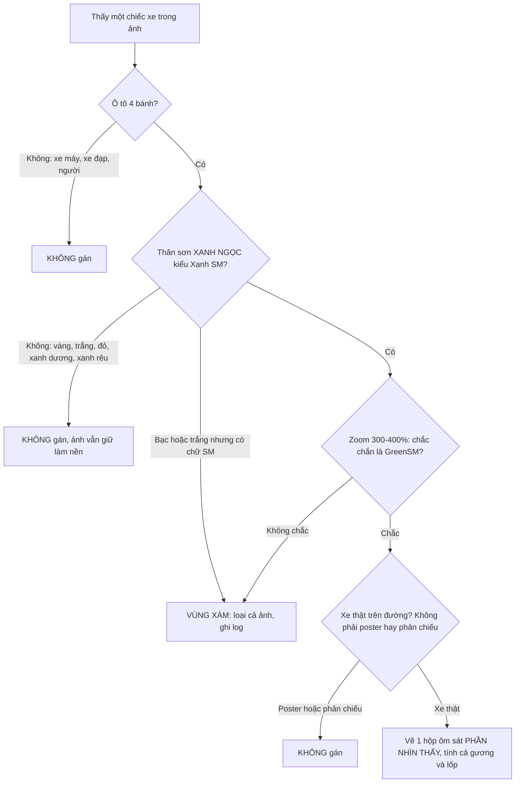

---

## 4. Vẽ hộp thế nào cho đúng

| # | Quy tắc |
|---|---|
| R1 | **Bốn mép hộp chạm đúng pixel ngoài cùng nhìn thấy của xe**: mũi xe, đuôi xe, điểm cao nhất của nóc, điểm thấp nhất của lốp chạm đất. |
| R2 | **Tính cả gương chiếu hậu**, ăng-ten ngắn, đèn trên nóc. **Không tính** bóng xe trên mặt đường, vệt đèn chiếu xuống đường. |
| R3 | **Bị che → chỉ ôm phần nhìn thấy.** Không ước lượng phần bị che. Nếu vật che nằm ở giữa xe (người, cột) thì hộp vẫn kéo từ pixel nhìn thấy trái nhất đến phải nhất của xe. |
| R4 | **Bị cắt ở mép ảnh → hộp dừng ở mép ảnh.** |
| R5 | **Mỗi xe đúng một hộp.** Hai xe đứng sát nhau thì hai hộp riêng. Hai hộp được phép chồng lên nhau. |
| R6 | **Xe nhoè do chạy nhanh → vẫn gán**, hộp ôm vùng nhoè của thân xe. |
| R7 | **Ảnh có viền đen** (pillarbox) → chỉ gán trong vùng ảnh thật. |
| R8 | **Xe nhỏ: phóng to 300–400% rồi mới chỉnh mép.** |

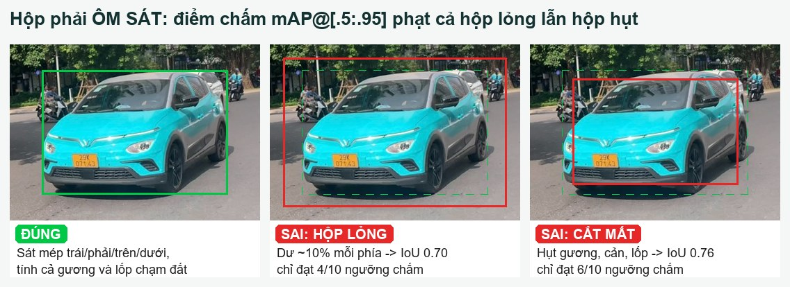

**Vì sao phải khắt khe với xe nhỏ?** Cùng lệch 3 pixel, xe 26 px mất gần một nửa số ngưỡng chấm, còn xe 300 px gần như không sao:

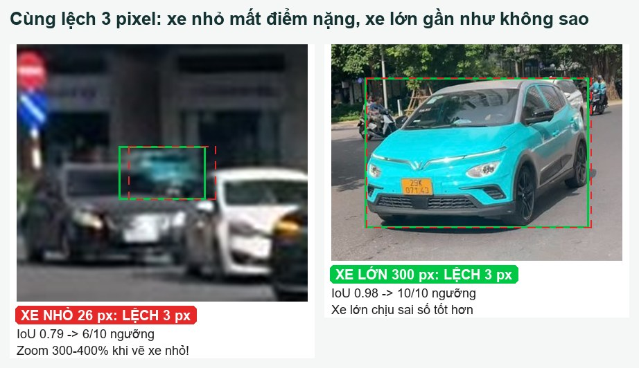

> 💡 **IoU là gì?** IoU = phần diện tích hai hộp chồng lên nhau chia cho tổng diện tích hai hộp gộp lại. Hai hộp trùng khít thì IoU = 1. Cuộc thi coi hộp là "đúng" ở ngưỡng t nếu IoU ≥ t, và chấm ở 10 ngưỡng 0,50 · 0,55 · … · 0,95. Hộp có IoU 0,70 chỉ đúng ở 4 ngưỡng (0,50–0,65).

Mẫu của BTC: hộp ôm từ mũi đến đuôi, từ nóc xuống chân bánh, kể cả khi xe bị nhoè.

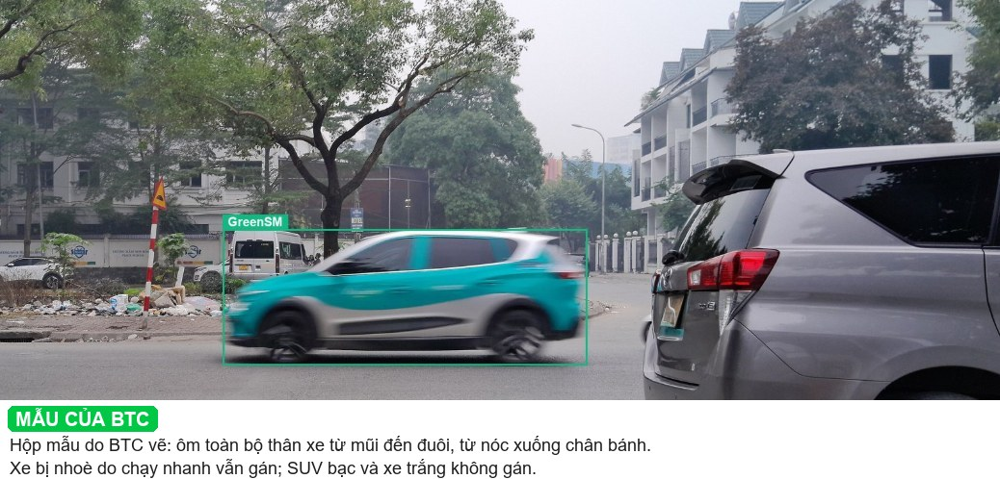

---

## 5. Tình huống đặc biệt

### 5.1. Xe nhỏ ở xa: vẫn gán, kể cả khi tí hon
Không có ngưỡng "nhỏ quá thì bỏ qua". Nhận ra được là GreenSM (màu xanh ngọc + khối xe khi zoom) thì gán. Không nhận ra được thì loại ảnh.

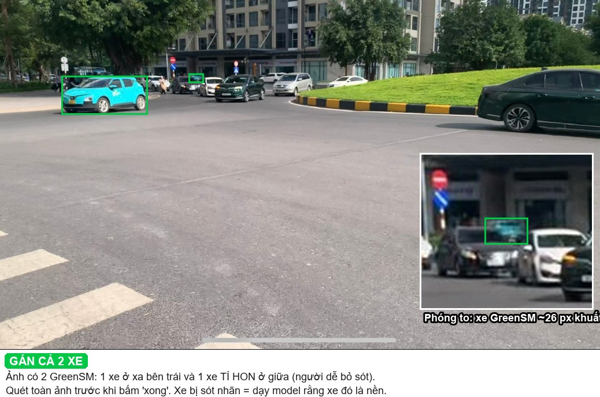

### 5.2. Bị che một phần: vẫn gán
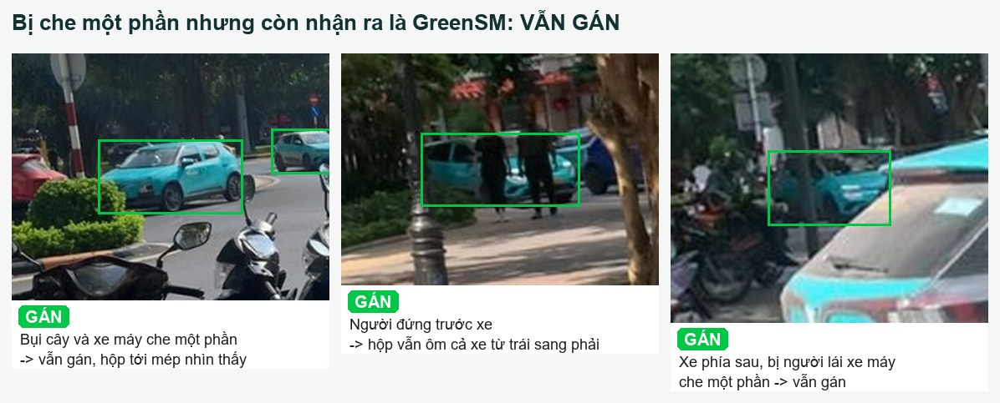

### 5.3. Hai xe sát nhau hoặc che nhau: mỗi xe một hộp
Xe phía sau chỉ lộ nóc và kính thì vẫn gán, hộp ôm đúng phần lộ ra.

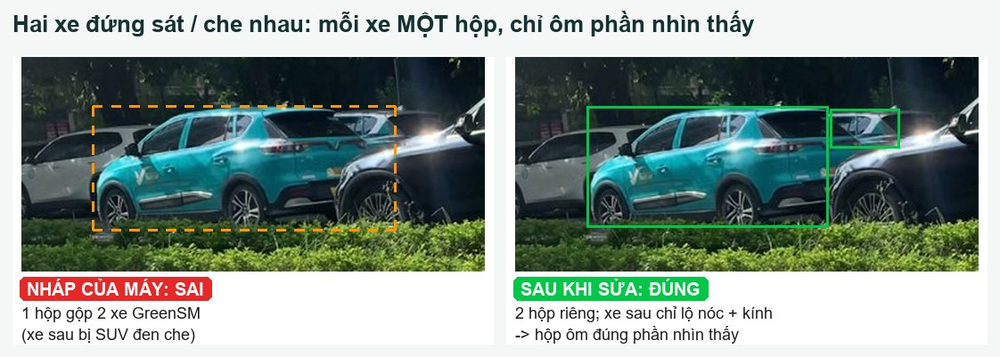

### 5.4. Nhiều GreenSM trong một ảnh và ảnh có viền đen
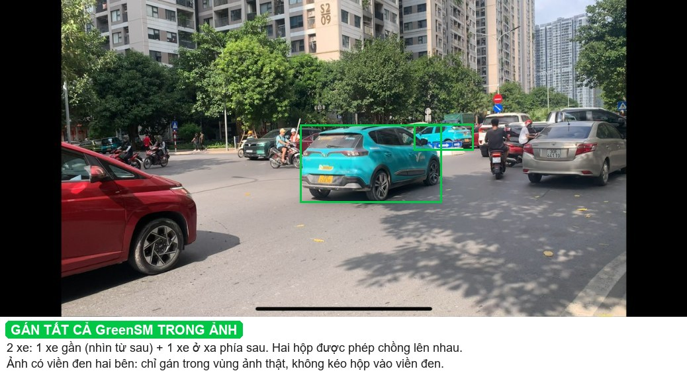

### 5.5. Các ca khác

| Tình huống | Quyết định |
|---|---|
| Xe đang đỗ ven đường | Gán như xe đang chạy |
| Chỉ thấy một mảng nhỏ xanh ngọc, không thấy khối xe | Loại ảnh (không chắc) |
| Xe trong bóng râm, màu tối hơn | Vẫn gán nếu nhận ra màu và logo |
| Khung hình mờ toàn bộ, không phân biệt được xe | Loại ảnh |
| Ảnh có thanh home-indicator iPhone ở đáy | Bình thường, gán như mọi ảnh |

---

## 6. Quy trình duyệt trong CVAT

**Một ảnh, bốn bước, đúng thứ tự:**

1. **Quét tìm xe bị sót.** Zoom lần lượt các vùng: đường chân trời, sau xe máy, sau cây, sau xe khác, vùng tối. Thấy GreenSM chưa có hộp thì vẽ mới. *Đây là lỗi đắt nhất.*
2. **Xoá hộp sai:** hộp trên xe không phải GreenSM, hộp trùng.
3. **Chỉnh mép từng hộp** theo mục 4. Xe nhỏ phải zoom 300–400%.
4. **Ghi log** (mục 9) rồi sang ảnh tiếp theo. Ảnh thuộc vùng xám thì ghi `exclude`.

**Phím tắt CVAT hay dùng:** `F` ảnh sau · `D` ảnh trước · `N` vẽ hộp mới · `Del` xoá hộp đang chọn · `Ctrl+Z` hoàn tác · `Ctrl+S` lưu · lăn chuột để zoom.
❓ Phím tắt có thể khác nhau giữa các phiên bản CVAT. Xem lại ở menu **Settings → Shortcuts** nếu không chạy.

**Tốc độ mục tiêu:** khoảng 3 ảnh/phút. Một ảnh mất quá 1 phút thường là ảnh khó, nên cân nhắc loại.

---

## 7. Nhãn nháp của máy hay sai kiểu nào

Đây là các lỗi đã thấy thật khi chạy máy gán nháp lên ảnh mẫu (cam = nháp của máy, xanh = đúng):

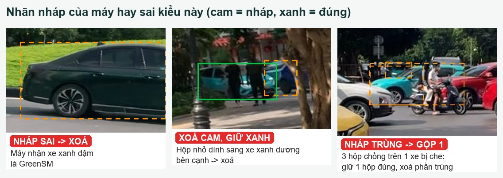

| Lỗi của máy | Cách sửa |
|---|---|
| Nhận **xe xanh đậm / xanh rêu** là GreenSM | Xoá |
| **Gộp 2 xe** đứng sát thành 1 hộp (hình ở mục 5.3) | Xoá, vẽ lại 2 hộp |
| Hộp nhỏ **dính sang xe bên cạnh** | Xoá |
| **Nhiều hộp chồng** trên một xe bị che | Giữ 1 hộp đúng, xoá phần còn lại |
| **Bỏ sót xe nhỏ** hoặc bị che | Vẽ mới (bước 1 ở mục 6) |
| Hộp đúng xe nhưng **lỏng hoặc hụt** vài pixel | Kéo mép cho sát |

---

## 8. Tự kiểm tra và sai số cho phép

**Trước khi export, xem lại từng ảnh:**
- [ ] Đã quét toàn ảnh, không còn GreenSM nào thiếu hộp
- [ ] Không có hộp nào trên xe khác màu, xe máy, poster
- [ ] Mỗi xe một hộp, không có hộp trùng
- [ ] Mép hộp sát (xe nhỏ đã zoom kiểm)
- [ ] Ảnh vùng xám đã ghi `exclude`, không còn nằm trong task

**Kiểm cả task:**
- [ ] Số ảnh đã duyệt bằng số ảnh trong task
- [ ] Export đúng định dạng **YOLO 1.1**, đặt tên `r1_<tên>.zip`

**Sai số cho phép:**

| Hạng mục | Mức đạt |
|---|---|
| Mép hộp, xe nhỏ (< 50 px) | Lệch ≤ 1 px |
| Mép hộp, xe lớn | Lệch ≤ 2–3 px |
| Hiệu chuẩn: 3 người vẽ chung 10 ảnh | IoU giữa hai người bất kỳ ≥ 0,85, số hộp khớp nhau |
| Kiểm chéo 15% số ảnh | ≤ 1 xe bị sót trên 20 ảnh |

---

## 9. Ghi log và báo vướng mắc

**`logs/labeling_log.csv`**, mỗi ảnh một dòng:

```
image,reviewer,n_prelabel,n_added,n_deleted,n_adjusted,action,reason,time
cuong_vongxuyen_1040_f000123.jpg,Cuong,3,1,1,2,keep,,11:32
long_ngatu_1050_f000045.jpg,Long,1,0,0,0,exclude,xe bac SM,11:40
```

- `action` = `keep` (giữ, kể cả ảnh nền) hoặc `exclude` (loại).
- **Gặp ca guideline chưa trả lời:** loại ảnh trước, rồi báo người giữ guideline (Trung) kèm tên ảnh. Ca nào được chốt thì bổ sung vào guideline v1.x, có ghi lịch sử thay đổi. **Không tự đặt quy tắc riêng.**

---

## 10. Tra nhanh

| Tình huống | Làm gì | Không làm | Loại ảnh? |
|---|---|---|---|
| GreenSM rõ ràng | Hộp sát, tính gương và lốp | Hộp lỏng "cho chắc" | Không |
| GreenSM bị che một phần | Hộp ôm phần nhìn thấy | Ước lượng phần bị che | Không |
| GreenSM cắt mép ảnh | Hộp dừng ở mép ảnh | — | Không |
| GreenSM nhỏ ở xa | Zoom 300–400% rồi vẽ | Bỏ qua vì nhỏ | Chỉ khi không chắc |
| Hai GreenSM sát nhau | 2 hộp riêng | Gộp 1 hộp | Không |
| Xe nhoè | Hộp ôm vùng nhoè | Bỏ qua | Không |
| VinFast màu khác, sedan xanh dương, xe xanh rêu | Không vẽ gì | Gán "cho an toàn" | Không (là ảnh nền tốt) |
| Xe bạc có chữ SM | — | Gán, hoặc giữ làm nền | **Có** |
| Không chắc có phải GreenSM | — | Đoán | **Có** |
| Ảnh không có GreenSM | Không vẽ, vẫn ghi `keep` | Bỏ qua bước xem | Không |

---

## Phụ lục A — Các quyết định nền (A1) và căn cứ

Nhóm **tự chốt** các điểm dưới đây, không hỏi BTC. Căn cứ là thể lệ và các guideline 2D của chính khoá học (trợ giảng gán bộ test nhiều khả năng theo cùng quy ước).

| Mã | Quyết định | Căn cứ |
|---|---|---|
| QĐ-01 | Xe bị che: hộp ôm **phần nhìn thấy** | Guideline lab DAY08 (detection xe 2D): *"Xe bị xe khác che một phần: Chỉ vẽ box cho phần nhìn thấy"*; DAY03: *"bbox ôm phần nhìn thấy được"*; guideline G01 (Week01): *"Bám sát biên vùng có thể quan sát được"* |
| QĐ-02 | **Tính gương chiếu hậu** | DAY08: *"Vẽ box ôm sát thân xe, tính cả gương và đèn"*; ảnh bìa BTC ôm toàn bộ thân xe |
| QĐ-03 | Cắt mép: hộp dừng ở mép ảnh | DAY08: *"Xe bị cắt ở mép ảnh: Chỉ vẽ box cho phần nằm trong ảnh"* |
| QĐ-04 | Xe Xanh SM màu bạc: **loại cả ảnh** | Slide 3: GreenSM là *"taxi Xanh SM sơn màu xanh đặc trưng"*; tài liệu ngữ cảnh mục 3b: *"cần quy ước rõ"*. Không biết trợ giảng chọn thế nào, nên loại ảnh để model không học theo hướng nào cả |
| QĐ-05 | Xe nhỏ: **không có ngưỡng bỏ qua**, nhận ra được thì gán | Tài liệu ngữ cảnh mục 3b: *"cần gán tất cả xe, kể cả xe nhỏ/bị che"*; SMP010 có xe *"rất nhỏ"*. Cách chấm mAP kiểu COCO không có vùng bỏ qua (khác lab DAY08 có ngưỡng 16 px) |
| QĐ-06 | **Không** dùng ảnh internet và 10 ảnh SMP để train. Ảnh SMP chỉ dùng làm hình minh hoạ trong guideline này | Slide 7: chỉ *"ảnh thô do chính đội thu thập"*; ảnh internet *"BTC sẽ xác nhận"* (chưa có xác nhận) |
| QĐ-07 | Không dùng biển vàng để nhận diện | Biển vàng có trên mọi xe kinh doanh vận tải |
| QĐ-08 | Mọi dòng xe Xanh SM sơn xanh ngọc đều gán | Định nghĩa theo màu sơn (slide 3), không theo dòng xe |
| QĐ-09 | Không gán xe buýt, xe tải, xe máy | Slide 3: *"Xe khác (xe con hãng khác, xe buýt, xe tải…) không gán nhãn"* |
| QĐ-10 | Ảnh nền vẫn phải có người xem qua | Slide 7: cấm *"nhãn do model sinh ra mà không kiểm tra lại"*; file nhãn rỗng cũng là một nhãn |

## Phụ lục B — Nguồn hình

Hình ở mục 2–7 dựng từ 11 ảnh mẫu trên website cuộc thi (ảnh bìa: Ni.Nguyen.VCLCA, CC BY-SA 4.0, Wikimedia Commons). Hộp do máy gán nháp (YOLOv8x COCO + lọc màu), **người đã kiểm và chỉnh tay** (ví dụ SMP003: máy gộp 2 xe, đã tách lại). Script dựng hình: `make_figures.py`. Các ảnh này **không** dùng để train (QĐ-06).

## Lịch sử thay đổi

| Phiên bản | Giờ | Thay đổi |
|---|---|---|
| v1.0 | 04/10 11:00 | Bản đầu tiên, chờ nhóm duyệt và hiệu chuẩn 10 ảnh |
